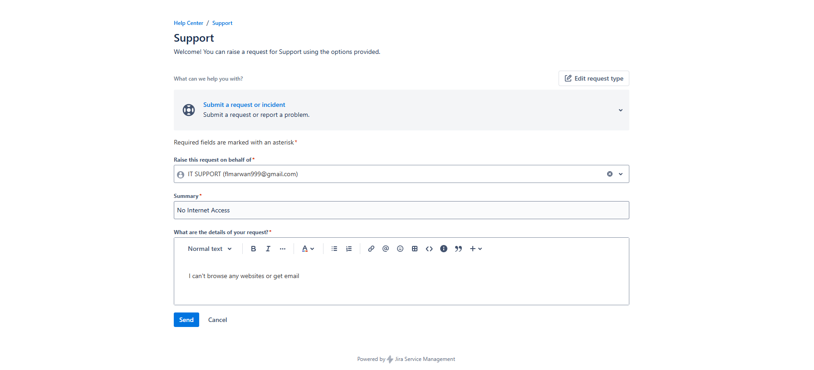
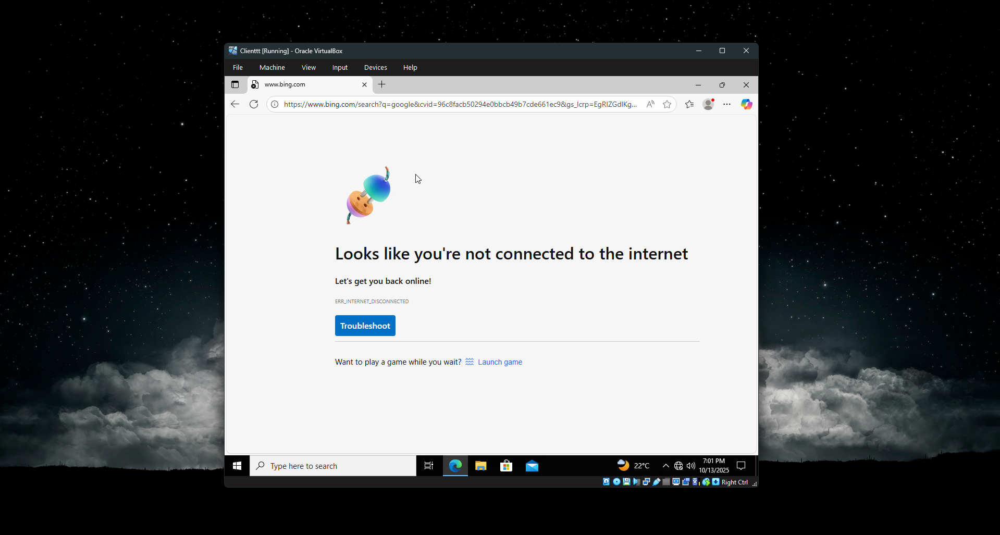
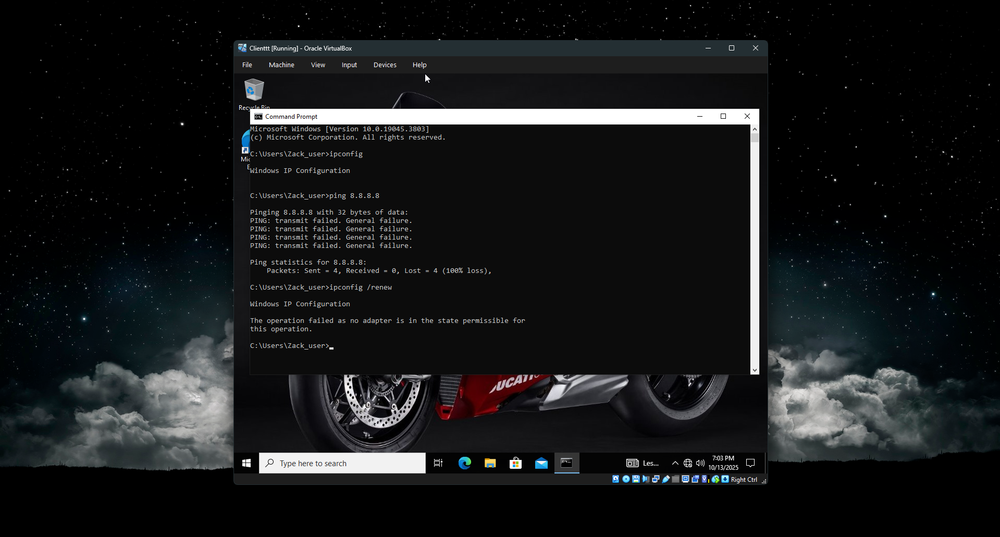
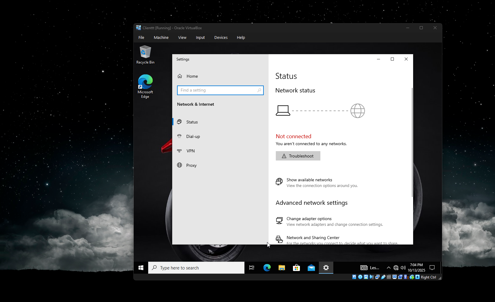
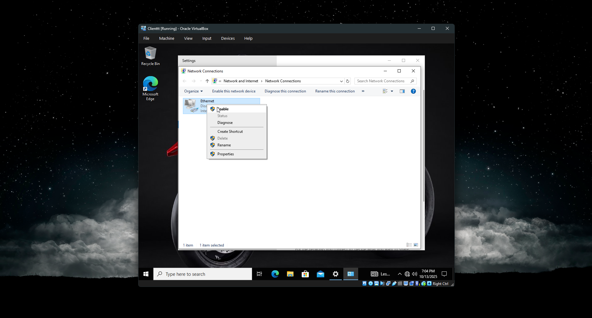
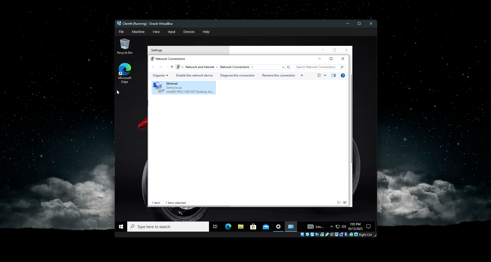
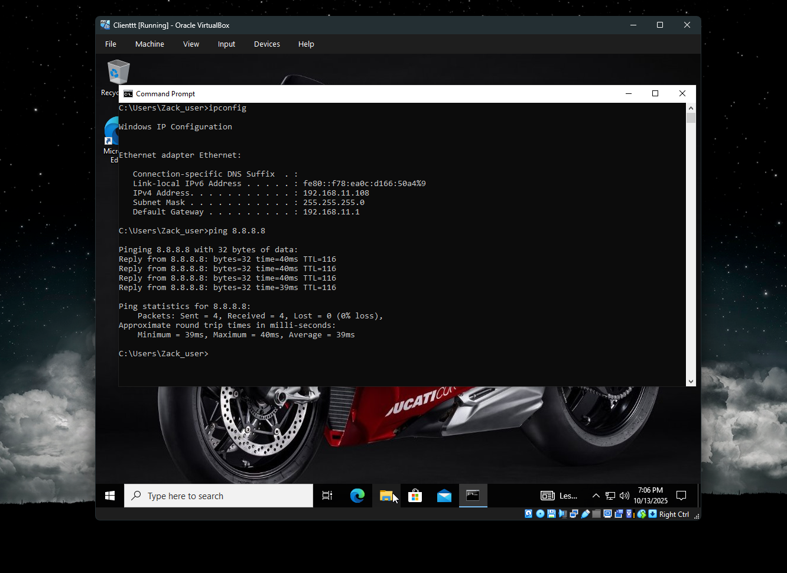
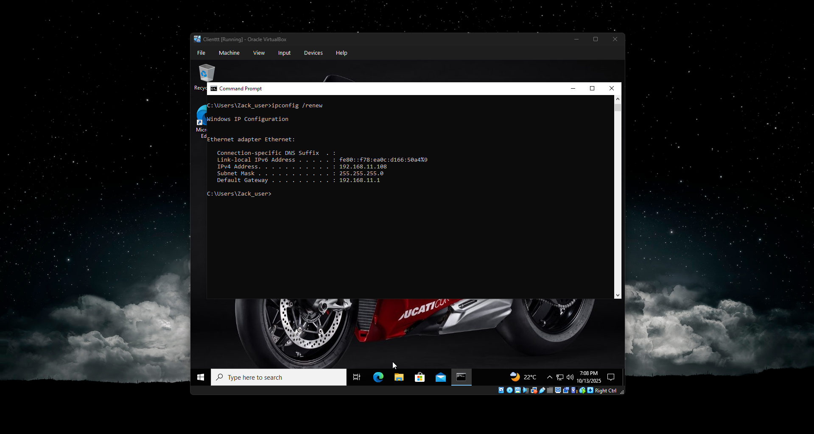
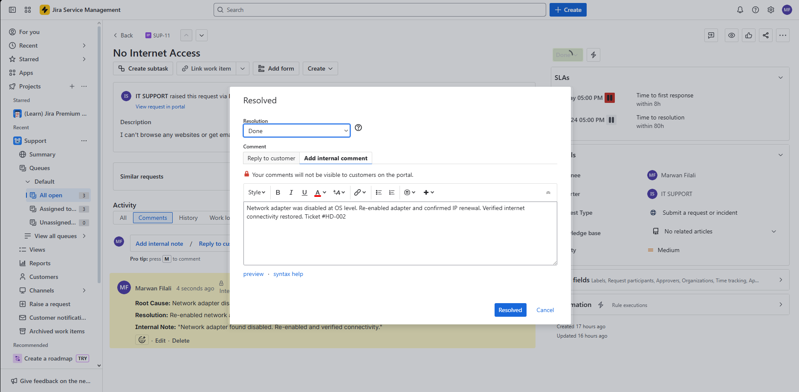

# Network-Troubleshooting---Adapter-Recovery
Network Troubleshooting: Network Adapter Recovery

## Overview
This project showcases systematic network troubleshooting skills by resolving a client connectivity issue caused by a disabled network adapter. The scenario demonstrates methodical problem isolation across the network stack.

## Environment & Technologies
- Windows Server 2022
- Windows 10/11 Client
- TCP/IP Networking
- Command Line Tools
- Jira Service Management
- Oracle VirtualBox

## Step-by-Step Implementation

### 1. Issue Identification
- User reported complete loss of internet access
- Ticket created in service desk with "No Internet Access" description

### 2. Initial Connectivity Tests
- Verified user could not browse websites or access email
- Observed "Not connected to internet" error message on client machine

### 3. Network Diagnostics
- Used Command Prompt to run `ping 8.8.8.8` - resulted in 100% packet loss
- Ran `ipconfig` showing no valid IP address assigned
- Determined issue was at the network adapter level

### 4. Root Cause Identification
- Navigated to Windows Network Settings
- Checked Network Connections control panel
- Discovered network adapter was in "Disabled" state

### 5. Resolution
- Right-clicked disabled adapter and selected "Enable"
- Returned to Command Prompt and ran `ipconfig /renew`
- Verified successful IP address assignment via DHCP

### 6. Verification & Documentation
- Tested internet connectivity by loading Google.com
- Confirmed full network access restored
- Updated service ticket with root cause and resolution steps
- Closed incident with detailed documentation

## Challenges & Solutions
- **Challenge**: Complete network isolation preventing remote troubleshooting
- **Solution**: Methodical layer-by-layer diagnosis starting from physical connectivity
- **Challenge**: User productivity impacted by network outage
- **Solution**: Quick identification of disabled adapter and immediate restoration

## Key Learnings
- OSI model troubleshooting methodology
- Windows network adapter management
- Command-line network diagnostics
- DHCP and IP configuration processes
- Enterprise incident documentation standards

## Screenshots

